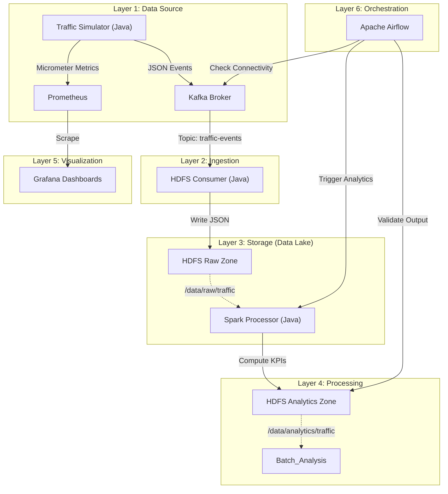

# Smart City Urban Traffic Analysis Pipeline

## Project Overview
This project implements an end-to-end **Big Data Pipeline** for analyzing urban traffic flow and citizen mobility in a Smart City context. It simulates a network of IoT traffic sensors, ingests data in real-time, stores it in a Data Lake (HDFS), processes it for insights (Spark), and visualizes Key Performance Indicators (KPIs) on dynamic dashboards (Grafana).

The entire workflow is containerized using Docker and orchestrated by Apache Airflow.

## Architecture
The solution follows a Lambda Architecture approach, combining real-time monitoring with batch processing.



### Key Components
1.  **Traffic Simulator** (`traffic-simulator`): Java Spring Boot app generating realistic traffic events (Speed, Vehicle Count, Occupancy) for multiple city zones.
2.  **Message Broker** (`Kafka`): Handles high-throughput real-time data ingestion.
3.  **HDFS Consumer** (`traffic-consumer-hdfs`): Consumes Kafka messages and persists them to HDFS as JSON files (Raw Layer).
4.  **Spark Processor** (`traffic-spark-processor`): Batch job that aggregates data to compute congestion rates and average speeds, saving results as Parquet (Analytics Layer).
5.  **Monitoring Stack**:
    *   **Prometheus**: Scrapes real-time application metrics from the Simulator.
    *   **Grafana**: Visualizes KPIs like "Vehicles per Zone", "Top 5 Congested Roads", and "Real-time Alerts".
6.  **Orchestrator** (`Airflow`): Automates the data engineering workflow.

---

## Getting Started

### Prerequisites
*   **Docker Desktop** (Running and configured with at least 4GB RAM)
*   **Java JDK 17** (For local development/building)
*   **Maven**

### Installation & Execution

1.  **Start Infrastructure**
    Start all services (Kafka, HDFS, Spark, Grafana, Airflow, Prometheus) using Docker Compose:
    ```bash
    cd docker
    docker-compose up -d
    ```

2.  **Start the Traffic Simulator** (Data Source)
    Run the simulator to start generating events on port **8081**:
    ```bash
    cd traffic-simulator
    ./mvnw spring-boot:run
    ```

3.  **Start the HDFS Consumer** (Ingestion)
    Run the consumer to save data to HDFS on port **8083**:
    ```bash
    cd traffic-consumer-hdfs
    ./mvnw spring-boot:run
    ```

4.  **Access Dashboards**
    *   **Grafana**: [http://localhost:3000](http://localhost:3000) (User: `admin` / Password: `admin`)
    *   **Airflow**: [http://localhost:8082](http://localhost:8082) (User: `airflow` / Password: `airflow`)
    *   **Spark Master**: [http://localhost:8080](http://localhost:8080)
    *   **HDFS Namenode**: [http://localhost:9870](http://localhost:9870)

---

## Pipeline Steps (Implementation Details)

### Step 1: Data Collection
*   **Module**: `traffic-simulator`
*   **Function**: Simulates 5 sensors across 4 roads and 3 zones. Generates random traffic spikes and congestion events.
*   **Output**: JSON events + Prometheus Metrics (`traffic_speed`, `traffic_occupancy`, `traffic_vehicles`).

### Step 2: Data Ingestion
*   **Tech**: Apache Kafka
*   **Topic**: `traffic-events`
*   **Details**: High-throughput messaging decoupling generation from storage.

### Step 3: Raw Storage (Data Lake)
*   **Module**: `traffic-consumer-hdfs`
*   **Path**: `hdfs://localhost:9000/data/raw/traffic/`
*   **Format**: JSON (partitioned by time).

### Step 4: Data Processing
*   **Module**: `traffic-spark-processor`
*   **Framework**: Apache Spark
*   **Logic**:
    *   Calculates Avg Speed per Road.
    *   Aggregates Traffic Volume per Zone.
    *   Identifies Congestion (Speed < 30km/h & Occupancy > 50%).

### Step 5: Analytics Zone
*   **Output Path**: `hdfs://localhost:9000/data/analytics/traffic/`
*   **Format**: Parquet (Optimized for columnar querying).

### Step 6: Visualization
*   **Tool**: Grafana + Prometheus
*   **Charts**:
    *   **Vehicle Volume**: Time series of car counts.
    *   **Speed Analysis**: Average speed monitoring.
    *   **Congestion Gauge**: Real-time traffic health.
    *   **Zone Distribution**: Pie chart of traffic by city sector.

### Step 7: Orchestration
*   **Tool**: Apache Airflow
*   **DAG**: `smart_city_traffic_pipeline`
*   **Schedule**: Hourly
*   **Tasks**: `check_kafka` -> `run_spark_job` -> `validate_hdfs_output`.

---

## Author
**Mohamed Ameziane** - *ENSET Mohammedia* - Big Data Engineering
**Elmahdi Elbatir** - *ENSET Mohammedia* - Big Data Engineering

